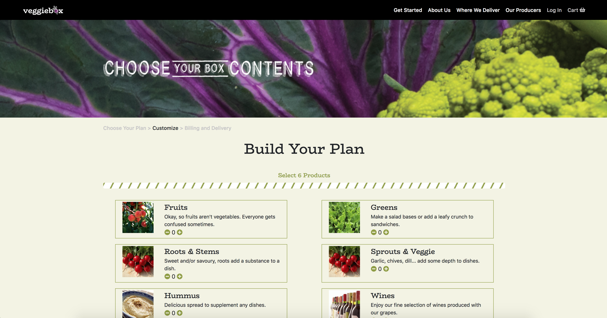

## Shopping Cart App
This is a project that I created as part of a coding challenge. The app allows a user select and remove product from a shopping cart.

## Tech Stack
This project was built using the following technologies:

* Javascript and JQuery
* Front-End: Bootstrap - The app is responsive and a11y-friendly.

## Getting Started

The app is hosted live at [Feature Request App Demo](http://featuredemoapp.us-west-1.elasticbeanstalk.com/) thanks to AWS Elastic Beanstalk and RDS, but if you want a local copy, continue reading.

These instructions will give you a local repository on your machine which you can then run and use.

```
git clone https://github.com/mariesta/ShoppingCart.git
```

Click on index.html OR (if you want a local web server and assuming you have npm installed):
```
(if you don't have http-server) npm install -g http-server
http-server -p 8080
```

Look 'Available on: [localhost url]'. If you navigate to this url, you should see this.



Adding items should show something like this:


You cannot add more than 6 items. Trying to add a 7th will show an error message:
<br>


The app is also responsive:
<br>


Have fun!

